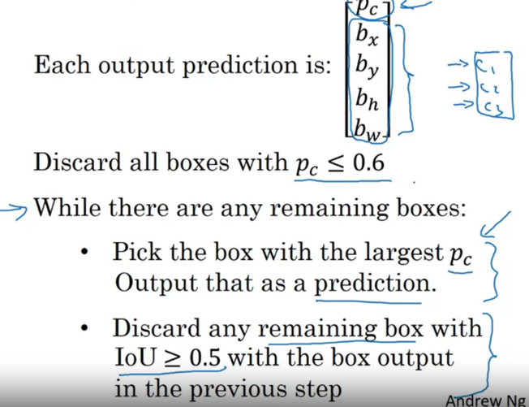
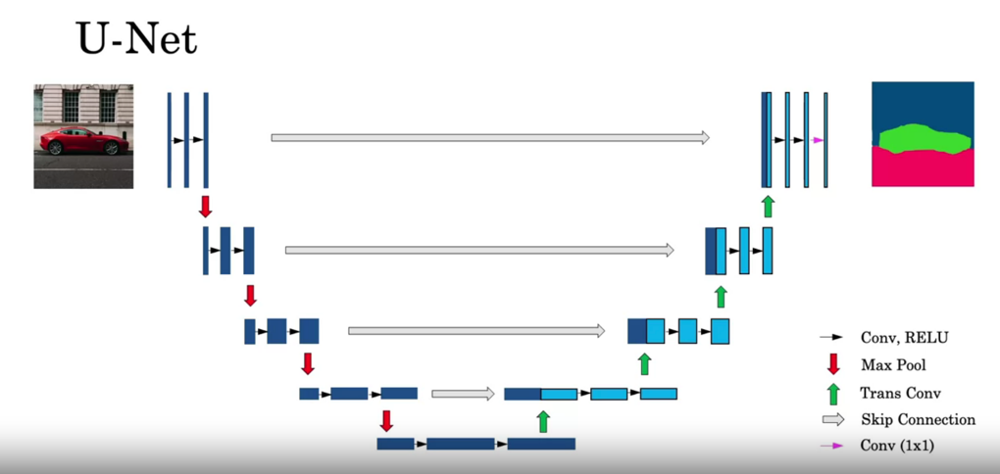
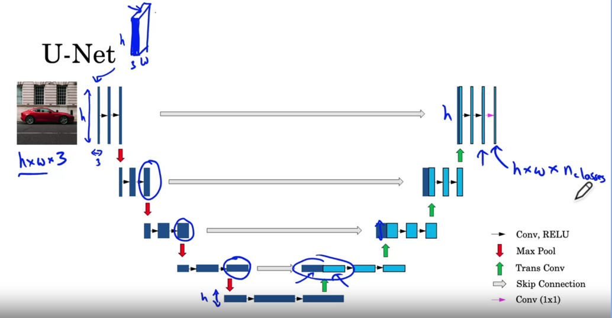

### Object Localization and Landmark detection
2. add output layer to predict bounding box (center coordinates, width and height) along with classification label
2. For face detection, predict landmark coordinates (l_x, l_y for around 64 points or more) as a task - useful in snapchat filters (AR), graphics design
3. Use the same for pose detection - based on specific keypoints and their occurence
4. labels have to be consistent to capture the same locations

### Object detection
**Sliding Windows Detection**
 idea is you basically go through every region of this size, and pass lots of little cropped images into the ConvNet and have it classified zero or one for each position as some stride. Now, having done this once with running this was called the sliding window through the image. You then repeat it, but now use a larger window. So, now you take a slightly larger region and run that region. So, resize this region into whatever input size the ConvNet is expecting, and feed that to the ConvNet and have it output zero or one. And then slide the window over again using some stride and so on. And you run that throughout your entire image until you get to the end. And then you might do the third time using even larger windows and so on. Right. And the hope is that if you do this, then **so long as there's a car somewhere in the image that there will be a window where, for example if you are passing in this window into the ConvNet, hopefully the ConvNet will have outputs one for that input region. So then you detect that there is a car there.** So this algorithm is called Sliding Windows Detection because you take these windows, these square boxes, and slide them across the entire image and classify every square region with some stride as containing a car or not. Now there's a huge disadvantage of Sliding Windows Detection, which is the computational cost.

 And if you use a very coarse stride, a very big stride, a very big step size, then that will reduce the number of windows you need to pass through the ConvNet, but that courser granularity may hurt performance. Whereas if you use a very fine granularity or a very small stride, then the huge number of all these little regions you're passing through the ConvNet means that means there is a very high computational cost. So, before the rise of Neural Networks people used to use much simpler classifiers like a simple linear classifier over hand engineer features in order to perform object detection. And in that era because each classifier was relatively cheap to compute, it was just a linear function, Sliding Windows Detection ran okay. It was not a bad method, but with ConvNet now running a single classification task is much more expensive and sliding windows this way is infeasibily slow. And unless you use a very fine granularity or a very small stride, you end up not able to localize the objects that accurately within the image as well. Fortunately however, this problem of computational cost has a pretty good solution. In particular, the Sliding Windows Object Detector can be implemented convolutionally or much more efficiently.
 
### Sliding Windows Object Detector convolutionally
one way of implementing this next layer, this fully connected layer is to implement this as a 5 by 5 filter and let's use 400 5 by 5 filters. So if you take a 5 by 5 by 16 image and convolve it with a 5 by 5 filter, remember, a 5 by 5 filter is implemented as 5 by 5 by 16 because our convention is that the filter looks across all 16 channels. So this 16 and this 16 must match and so the outputs will be 1 by 1. And if you have 400 of these 5 by 5 by 16 filters, then the output dimension is going to be 1 by 1 by 400. So rather than viewing these 400 as just a set of nodes, we're going to view this as a 1 by 1 by 400 volume. Mathematically, this is the same as a fully connected layer because each of these 400 nodes has a filter of dimension 5 by 5 by 16. So each of those 400 values is spme arbitrary linear function of these 5 by 5 by 16 activations from the previous layer. Next, to implement the next convolutional layer, we're going to implement a 1 by 1 convolution. If you have 400 1 by 1 filters then, with 400 filters the next layer will again be 1 by 1 by 400. So that gives you this next fully connected layer. And then finally, we're going to have another 1 by 1 filter, followed by a softmax activation. So as to give a 1 by 1 by 4 volume to take the place of these four numbers that the network was operating

#### Method
To run sliding windows on this 16 by 16 by 3 image is pretty small image. You run this convnet four times in order to get four labels. But it turns out a lot of this computation done by these four convnets is highly duplicative. So what the convolutional implementation of sliding windows does is it allows these four passes in the convnet to share a lot of computation.

t turns out that this blue 1 by 1 by 4 subset gives you the result of running in the upper left hand corner 14 by 14 image. This upper right 1 by 1 by 4 volume gives you the upper right result. The lower left gives you the results of implementing the convnet on the lower left 14 by 14 region. And the lower right 1 by 1 by 4 volume gives you the same result as running the convnet on the lower right 14 by 14 medium.

So what this process does, what this convolution implementation does is, instead of forcing you to run four propagation on four subsets of the input image independently, Instead, it combines all four into one form of computation and shares a lot of the computation in the regions of image that are common.

### Accurate bounding boxes
YOLO - You only Look Once algorithm
breaks image into a grid and the produces the output vector per grid - [0/1 <bb> <cls_labels>] instead of just only vector like object detection. or the sliding window Object detector
so for a grid of 3x3, the output volume would be 3x3x8

As long as there are not multiple objects in the grid cell, this works really well --> else also we can use a fine-grained grid, such as 19x19
Mid point of the object decides which grid it belongs to, even if it spans multiple grid cells

not running the same algorithm 361 times or 19 squared times -> this is one single convolutional implementation, where you use one convnet with a lot of shared computation between all the computations needed for all of your 3 by 3 or all of your 19 by 19 grid cells. 

#### Bounding box definition
if the object is spanning over multiple grids
b_x,b_y --> midpoint relative to the grid (0.4, 0.3) if the grid span across (0,0) to (1,1)
b_h, b_w --> **relative** width occupied by the object within the item. 
 So if spanning across grid cells, it will (0.9, 0.5) (90% width is within the grid, height is 50% within the grid cell)
 but this could be > 1 if it spans more than 2 or 3 grids --> need to think about this

there are multiple ways of specifying the bounding boxes, but this would be one convention that's quite reasonable. Although, if you read the YOLO research papers, the YOLO research line there were other parameterizations that work even a little bit better, but I hope this gives one reasonable condition that should work okay. Although, there are some more complicated parameterizations involving sigmoid functions to make sure this is between 0 and 1. And using an explanation parameterization to make sure that these are non-negative, since 0.9, 0.5, this has to be greater or equal to zero. There are some other more advanced parameterizations that work things a little bit better, but the one you saw here should work okay.

#### Intersection over Union
 it computes the intersection over union of these two bounding boxes. 

 the computer vision task will judge that your answer is correct if the IoU is greater than 0.5. And if the predicted and the ground-truth bounding boxes overlapped perfectly, the IoU would be one, because the intersection would equal to the union. But in general, so long as the IoU is greater than or equal to 0.5, then the answer will look okay, look pretty decent. And by convention, very often 0.5 is used as a threshold to judge as whether the predicted bounding box is correct or not. This is just a convention. If you want to be more stringent, you can judge an answer as correct, only if the IoU is greater than equal to 0.6 or some other number.

what motivates the definition of IoU, as a way to evaluate whether or not your object localization algorithm is accurate or not. But more generally, IoU is a measure of the overlap between two bounding boxes. Where if you have two boxes, you can compute the intersection, compute the union, and take the ratio of the two areas. And so this is also a way of measuring how similar two boxes are to each other. 

### Non Max Suppression
because you're running the image classification and localization algorithm on every grid cell, on 361 grid cells, it's possible that many of them will raise their hand and say, "My Pc, my chance of thinking I have an object in it is large." Rather than just having two of the grid cells out of the 19 squared or 361 think they have detected an object. So, when you run your algorithm, you might end up with multiple detections of each object. So, what non-max suppression does, is it cleans up these detections. So they end up with just one detection per car, rather than multiple detections per car. So concretely, what it does, is it first looks at the probabilities associated with each of these detections.

Pc with the probability of a detection. And it first takes the largest one, which in this case is 0.9 and says, "That's my most confident detection, so let's highlight that and just say I found the car there." Having done that the non-max suppression part then looks at all of the remaining rectangles and all the ones with a high overlap, with a high IOU, with this one that you've just output will get suppressed. So those two rectangles with the 0.6 and the 0.7. Both of those overlap a lot with the light blue rectangle. So those, you are going to suppress and darken them to show that they are being suppressed. Next, you then go through the remaining rectangles and find the one with the highest probability, the highest Pc, which in this case is this one with 0.8. So let's commit to that and just say, "Oh, I've detected a car there." And then, the non-max suppression part is to then get rid of any other ones with a high IOU. So now, every rectangle has been either highlighted or darkened. And if you just get rid of the darkened rectangles, you are left with just the highlighted ones, and these are your two final predictions. So, this is non-max suppression. And non-max means that you're going to output your maximal probabilities classifications but suppress the close-by ones that are non-maximal. Hence the name, non-max suppression. 

Now, to intimate non-max suppression, the first thing you can do is discard all the boxes, discard all the predictions of the bounding boxes with Pc less than or equal to some threshold, let's say 0.6. So we're going to say that unless you think there's at least a 0.6 chance it is an object there, let's just get rid of it. This has caused all of the low probability output boxes. The way to think about this is for each of the 361 positions, you output a bounding box together with a probability of that bounding box being a good one. So we're just going to discard all the bounding boxes that were assigned a low probability. Next, while there are any remaining bounding boxes that you've not yet discarded or processed, you're going to repeatedly pick the box with the highest probability, with the highest Pc, and then output that as a prediction. So this is a process on a previous slide of taking one of the bounding boxes, and making it lighter in color. So you commit to outputting that as a prediction for that there is a car there. Next, you then discard any remaining box. Any box that you have not output as a prediction, and that was not previously discarded. So discard any remaining box with a high overlap, with a high IOU, with the box that you just output in the previous step. This second step in the while loop was when on the previous slide you would darken any remaining bounding box that had a high overlap with the bounding box that we just made lighter, that we just highlighted. And so, you keep doing this while there's still any remaining boxes that you've not yet processed, until you've taken each of the boxes and either output it as a prediction, or discarded it as having too high an overlap, or too high an IOU, with one of the boxes that you have just output as your predicted position for one of the detected objects.

### Anchor Box
If the same grid cell, has two classes with the same midpoint, but different shapes? --> then we can use Anchor boxes

 for that grid cell, if Y outputs this vector where you are detecting three causes, pedestrians, cars and motorcycles, it won't be able to output two detections. So I have to pick one of the two detections to output. With the idea of anchor boxes, what you are going to do, is pre-define two different shapes called, anchor boxes or anchor box shapes. And what you are going to do is now, be able to associate two predictions with the two anchor boxes.

What if you have two anchor boxes but three objects in the same grid cell? That's one case that this algorithm doesn't handle well.
what if you have two objects associated with the same grid cell, but both of them have the same anchor box shape? Again, that's another case that this algorithm doesn't handle well.

Need tiebreakers to be implemented within the code.

even though I'd motivated anchor boxes as a way to deal with what happens if two objects appear in the same grid cell, in practice, that happens quite rarely, especially if you use a 19 by 19 rather than a 3 by 3 grid. The chance of two objects having the same midpoint rather these 361 cells, it does happen, but it doesn't happen that often.

Maybe even better motivation or even better results that anchor boxes gives you is it allows your learning algorithm to specialize better. In particular, if your data set has some tall, skinny objects like pedestrians, and some white objects like cars, then this allows your learning algorithm to specialize so that some of the outputs can specialize in detecting white, fat objects like cars, and some of the output units can specialize in detecting tall, skinny objects like pedestrians. 

So finally, how do you choose the anchor boxes?
 just choose them by hand or choose maybe five or 10 anchor box shapes that spans a variety of shapes that seems to cover the types of objects you seem to detect.

In one of the later YOLO research papers, is to use a K-means algorithm, to group together two types of objects shapes you tend to get. And then to use that to select a set of anchor boxes that this most stereotypically representative of the maybe multiple, of the maybe dozens of object causes you're trying to detect. But that's a more advanced way to automatically choose the anchor boxes. And if you just choose by hand a variety of shapes that reasonably expands the set of object shapes, you expect to detect some tall, skinny ones, some fat, white ones. That should work with these as well

### YOLO

you run this through non-max suppression. So just to make it interesting. Let's look at the new test set image. Here's how you would run non-max suppression. If you're using two anchor boxes, then for each of the non-grid cells, you get two predicted bounding boxes. Some of them will have very low probability, very low Pc, but you still get two predicted bounding boxes for each of the nine grid cells. So let's say, those are the bounding boxes you get. And notice that some of the bounding boxes can go outside the height and width of the grid cell that they came from. Next, you then get rid of the low probability predictions. So get rid of the ones that even the neural network says, gee this object probably isn't there. So get rid of those. And then finally if you have three classes you're trying to detect, you're trying to detect pedestrians, cars and motorcycles. What you do is, for each of the three classes, independently run non-max suppression for the objects that were predicted to come from that class. But use non-max suppression for the predictions of the pedestrians class, run non-max suppression for the car class, and non-max suppression for the motorcycle class. But run that basically three times to generate the final predictions. And so, the output of this is hopefully that you will have detected all the cars and all the pedestrians in this image.

### Region Proposals

### Semantic Segmentation with U-Net
 a familiar convolutional neural network architecture, where you input an image which is fed forward through multiple layers in order to generate a class label y hat. In order to change this architecture into a semantic segmentation architecture, let's get rid of the last few layers and one key step of semantic segmentation is that, whereas the dimensions of the image have been generally getting smaller as we go from left to right, it now needs to get bigger so they can gradually blow it back up to a full-size image, which is a size you want for the output. Specifically, this is what a unit architecture looks like. As we go deeper into the unit, the height and width will go back up while the number of channels will decrease so the unit architecture looks like this until eventually, you get your segmentation map of the cat. One operation we have not yet covered is what does this look like? To make the image bigger. To explain how that works, you have to know how to implement a transpose convolution.

#### Transpose Convolution

 In the transpose convolution, instead of placing the filter on the input, you would instead place a filter on the output.
 
, the padding area isn't going to contain any values. What we're going to end up doing is ignore this paddy region and just throw in four values in the red highlighted area and specifically, the upper left entry is zero times two, so that's zero. The second entry is one times two, that is two. Down here is two times two, that's four, and then over here is one times two so that's equal to two.

You may notice that there is some overlap between the places where we copy the red-colored version of the filter and the green version and we cannot simply copy the green value over the red one. Where the red and the green boxes overlap, you add two values together.

there are multiple possible ways to take small inputs and turn it into bigger outputs, but the transpose convolution happens to be one that is effective and when you learn all the parameters of the filter here, this turns out to give good results when you put this in the context of the union which is the learning algorithm will use now.

#### Skip connections
the detailed spatial information is lost because of heightened with is much smaller. Then the second half of this neural network uses the transports convolution to blow the representation size up back to the size of the original input image. Now it turns out that there's one modification to this architecture that would make it work much better. And that's what we turn this into the unit architecture, which is that skip connections from the earlier layers to the later layers like this. So that this earlier block of activations is copied directly to this later block. So why do we want to do this? It turns out that for this, next final layer to decide which region is a cat. Two types of information are useful. One is the high level, spatial, high level contextual information which it gets from this previous layer. Where hopefully the neural network, we have figured out that in the lower right hand corner of the image or maybe in the right part of the image, there's some cat like stuff going on. But what is missing is a very detailed, fine grained spatial information. Because this set of activations here has lower spatial resolution to heighten with is just lower. So what the skip connection does is it allows the neural network to take this very high resolution, low level feature information where it could capture for every pixel position, how much fairy stuff is there in this pixel? And used to skip connection to pause that directly to this later layer. And so this way this layer has both the lower resolution, but high level, spatial, high level contextual information, as well as the low level. But more detailed texture like information in order to make a decision as to whether a certain pixel is part of a cat or not. In this video, you saw just a brief, high level intuition about how U-Net works.

### U Net Architecture

First half --> this is the normal convolution layers with activation functions --> with occasional max pooling layers.

Second half -  transpose convolution layers, which I'm going to note by the green arrow in order to build the dimension of this neural network back up. So with the first transpose convolutional layer or trans conv layer, you're going to get a set of activations that looks like that. In this example, we did not increase the height and width, but we did decrease the number of channels. But there's one more thing you need to do to build a unit, which is to add in that skip connection which I'm going to denote with this grey arrow. What the skip connection does is it takes this set of activations and just copies it over to the right. And so the set of activations you end up with is like this. The light blue part comes from the transpose convolution, and the dark blue part is just copied over from the left. 

we're back to a set of activations that is the original input images, height and width. We're going to have a couple more layers of a normal fee forward convolutions, and then finally, to take this and map this to our segmentation map, we're going to use a one by one convolution which I'm going to denote with that magenta arrow to finally give us this which is going to be our output.

The dimensions of this output layer is going to be h by w, so the same dimensions as our original input by num classes. So if you have three classes to try and recognize, this will be three. If you have ten different classes to try to recognize in your segmentation at then that last number will be ten. And so what this does is for every one of your pixels you have h by w pixels you have, an array or a vector, essentially of n classes numbers that tells you for our pixel how likely is that pixel to come from each of these different classes. And if you take a arg max over these n classes, then that's how you classify each of the pixels into one of the classes, and you can visualize it like the segmentation map showing on the right.

