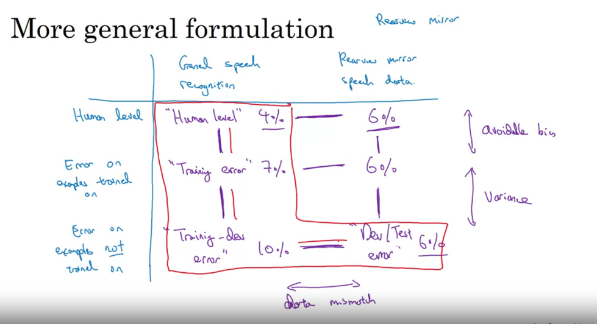

### Training data - Dev and Test set
 you're building a mobile app where users will upload pictures taken from their cell phones, and you want to recognize whether the pictures that your users upload from the mobile app is a cat or not.

1. you've gotten 10,000 pictures uploaded from the mobile app. But by crawling the web you can download huge numbers of cat pictures, and maybe you have 200,000 pictures of cats downloaded off the Internet.
2. Because in the end, your users will be uploading pictures like those on the right and you need your classifier to do well on that. But you now have a bit of a dilemma because you have a relatively small dataset, just 10,000 examples drawn from that distribution. And you have a much bigger dataset that's drawn from a different distribution. There's a different appearance of image than the one you actually want. So you don't want to use just those 10,000 images because it ends up giving you a relatively small training set.
3. And using those 200,000 images seems helpful, but the dilemma is this 200,000 images isn't from exactly the distribution you want.
4. Option-1: shuffle and use all the data for training/dev and test - > The advantage is that now you're training, dev and test sets will all come from the same distribution, so that makes it easier to manage. But the disadvantage, and this is a huge disadvantage, is that if you look at your dev set, of these 2,500 examples, a lot of it will come from the web page distribution of images, rather than what you actually care about, which is the mobile app distribution of images.
5. But the count of webpage distribution would be too high in the dev set
6. Option-2: The training set, let's say it's still 205,000 images, I would have the training set have all 200,000 images from the web. And then you can, if you want, add in 5,000 images from the mobile app. Your dev and test sets would be all mobile app images.

TL:DR;
1. Dev and Test set should be exactly from the same distribution
2. Dev and Test set should match only the product outcome planned. There should not any leak of training data from other sources into Dev/Test sets.
3. We can use smaller dev/test datasets if there is only little data and use the rest for training. But larger commonly available data used for training should not be used in dev/test sets.

### Bias Variance mismatch
1.  training error 1%, dev error 10% when two things changed at a time. 
2. One is that the algorithm saw data in the training set but not in the dev set. Two, the distribution of data in the dev set is different. And because you changed two things at the same time, it's difficult to know of this 9% increase in error, how much of it is because the algorithm didn't see the data in the dev set, so that's some of the variance part of the problem.

**training-dev set** - this is a new subset of data, which we carve out that should have the same distribution as training sets, but you don't explicitly train your neural network on this.

dev and test sets have the same distribution, but the training sets will have some different distribution. What we're going to do is randomly shuffle the training sets and then carve out just a piece of the training set to be the training-dev set. So just as the dev and test set have the same distribution, the training set and the training-dev set, also have the same distribution.

#### Indication of a variance problem using training-dev set
train your neural network, just on the training set proper. You won't let the neural network, you won't run that obligation on the training-dev portion of this data. To carry out error analysis, what you should do is now look at the error of your classifier on the training set, on the training-dev set, as well as on the dev set.

So let's say in this example that your training error is 1%.

And let's say the error on the training-dev set is 9%, and the error on the dev set is 10%, same as before.

What you can conclude from this is that when you went from training data to training dev data the error really went up a lot. And only the difference between the training data and the training-dev data is that your neural network got to sort the first part of this. It was trained explicitly on this, but it wasn't trained explicitly on the training-dev data. So this tells you that you have a variance problem.

Because the training-dev error was measured on data that comes from the same distribution as your training set. So you know that even though your neural network does well in a training set, it's just not generalizing well to data in the training-dev set which comes from the same distribution, but it's just not generalizing well to data from the same distribution that it hadn't seen before.

So in this example we have really a variance problem.

#### Indication of a data mismatch problem using training-dev set
Let's say the training error is 1%, and the training-dev error is 1.5%, but when you go to the dev set your error is 10%. So now, you have actually a pretty low variance problem, because when you went from training data that you've seen to the training-dev data that the neural network has not seen, the error increases only a little bit, but then it really jumps when you go to the dev set. So this is a data mismatch problem, where data mismatched.

whatever algorithm it's learning, it works great on training-dev but it doesn't work well on dev. So somehow your algorithm has learned to do well on a different distribution than what you really care about, so we call that a data mismatch problem.

#### Indication of a high bias
Let's say that training error is 10%, training-dev error is 11%, and dev error is 12%. Remember that human level proxy for Bayes error is roughly 0%. So if you have this type of performance, then you really have a bias, an avoidable bias problem, because you're doing much worse than human level. So this is really a high bias setting.

If your training error is 10%, your training-dev error is 11% and your dev error is 20 %, then it looks like this actually has two issues. One, the avoidable bias is quite high, because you're not even doing that well on the training set. Humans get nearly 0% error, but you're getting 10% error on your training set. The variance here seems quite small,
but data mismatch is quite large. So for for this example I will say, you have a large bias or avoidable bias problem as well as a data mismatch problem.

#### TLDR
1. The key quantities I would look at are human level error, your training set error, your training-dev set error.
2. you can get a sense of how big is the avoidable bias, the variance, the data mismatch problems.

Human Level - Training Error --> Avoidable bias
Training error - Train-Dev Error --> Variance issue
Train-Dev Error - Dev/Test Error --> Data mismatch  

#### Data Mismatch
1. Manual error analysis
2. Make training data more similar / collect data similar to dev/test sets
3. Artificial data synthesis
4. Note: with a lot of synthesized data, a single sample of clean noise, might overfit to only to that sample space.. Especially when combining multiple data points
5. And the challenge with artificial data synthesis is to the human ear, as far as your ears can tell, these 10,000 hours all sound the same as this one hour, so you might end up creating this very impoverished synthesized data set from a much smaller subset of the space without actually realizing it. 

NOTE: artificial data synthesis significantly boost the performance of what were already very good speech recognition system. So, it can work very well. But, if you're using artificial data synthesis, just be cautious and bear in mind whether or not you might be accidentally simulating data only from a tiny subset of the space of all possible examples. 

